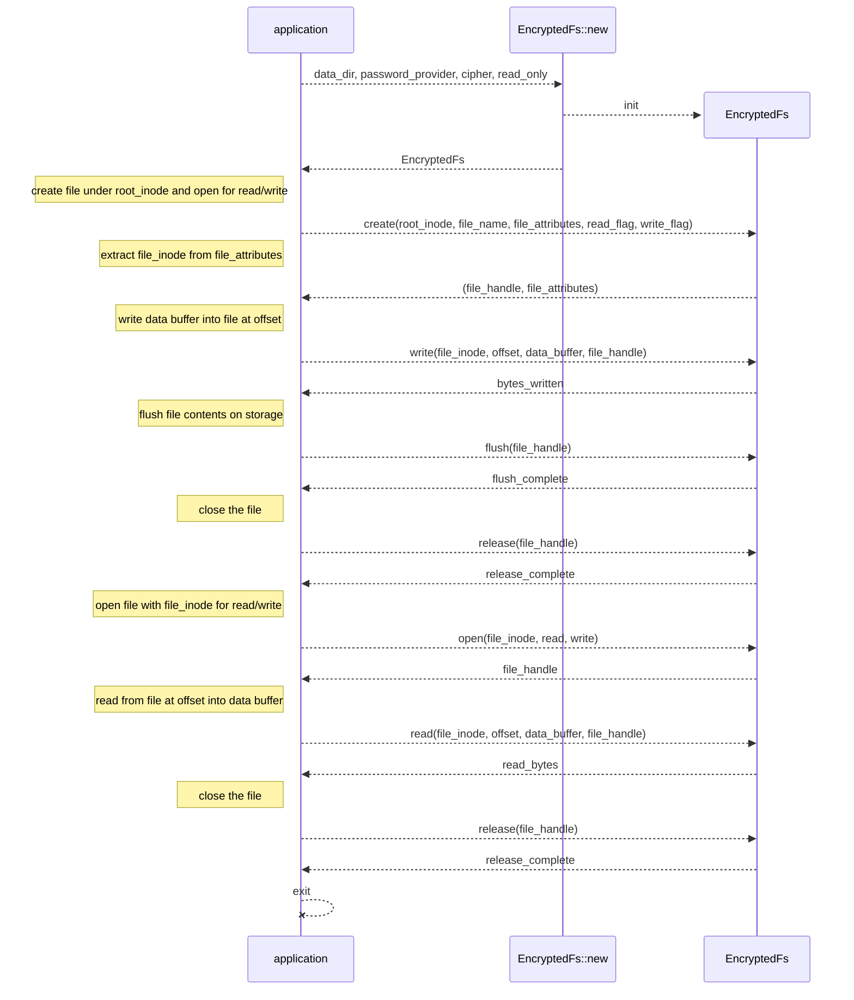

```mermaid
sequenceDiagram
    participant application
    participant enc_new as EncryptedFs::new
    application -->> enc_new: data_dir, password_provider, cipher, read_only
    create participant EncryptedFs
    enc_new -->> EncryptedFs: init
    enc_new -->> application: EncryptedFs

    Note left of application: create file under root_inode and open for read/write
    application -->> EncryptedFs: create(root_inode, file_name, file_attributes, read_flag, write_flag)

    Note left of application: extract file_inode from file_attributes
    EncryptedFs -->> application: (file_handle, file_attributes)

    Note left of application: write data buffer into file at offset
    application -->> EncryptedFs: write(file_inode, offset, data_buffer, file_handle)
    EncryptedFs -->> application: bytes_written

    Note left of application: flush file contents on storage
    application -->> EncryptedFs: flush(file_handle)
    EncryptedFs -->> application: flush_complete

    Note left of application: close the file
    application -->> EncryptedFs: release(file_handle)
    EncryptedFs -->> application: release_complete

    Note left of application: open file with file_inode for read/write
    application -->> EncryptedFs: open(file_inode, read, write)
    EncryptedFs -->> application: file_handle

    Note left of application: read from file at offset into data buffer
    application -->> EncryptedFs: read(file_inode, offset, data_buffer, file_handle)
    EncryptedFs -->> application: read_bytes

    Note left of application: close the file
    application -->> EncryptedFs: release(file_handle)
    EncryptedFs -->> application: release_complete

    application --x application: exit
```

Further details about the internals of create, open, close, read and write flows can be found
in [flows](../readme/flows.md).
