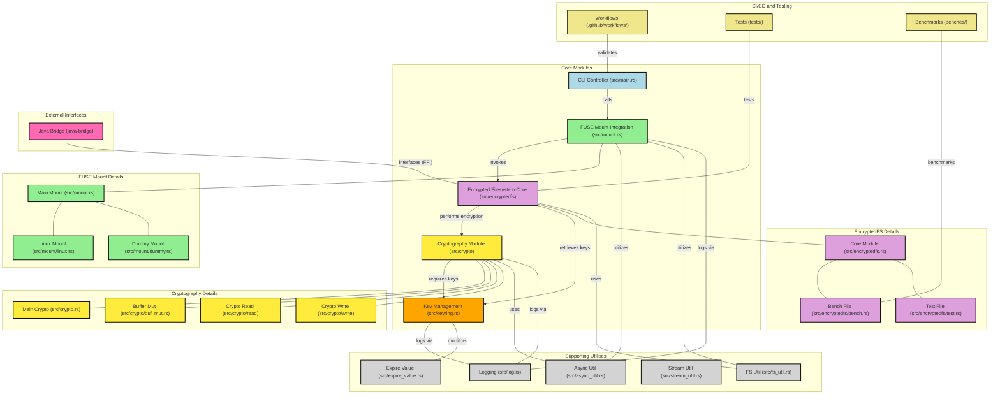

You can always generate this diagram based on latest code [here](https://gitdiagram.com/xoriors/rencfs).

```mermaid
flowchart TD
    %% Core Modules Subgraph
    subgraph "Core Modules"
        CLI["CLI Controller (src/main.rs)"]
        FUSE["FUSE Mount Integration (src/mount.rs)"]
        FS["Encrypted Filesystem Core (src/encryptedfs)"]
        CRYPTO["Cryptography Module (src/crypto)"]
        KEY["Key Management (src/keyring.rs)"]
    end

    %% Supporting Utilities Subgraph
    subgraph "Supporting Utilities"
        ASYNC["Async Util (src/async_util.rs)"]
        FSUTIL["FS Util (src/fs_util.rs)"]
        LOG["Logging (src/log.rs)"]
        STREAM["Stream Util (src/stream_util.rs)"]
        EXPIRE["Expire Value (src/expire_value.rs)"]
    end

    %% External Interfaces Subgraph
    subgraph "External Interfaces"
        JAVA_BRIDGE["Java Bridge (java-bridge)"]
    end

    %% CI/CD and Testing Subgraph
    subgraph "CI/CD and Testing"
        WORKFLOWS["Workflows (.github/workflows/)"]
        TESTS["Tests (tests/)"]
        BENCHES["Benchmarks (benches/)"]
    end

    %% Detailed EncryptedFS Subgraph
    subgraph "EncryptedFS Details"
        ENC_CORE["Core Module (src/encryptedfs.rs)"]
        ENC_BENCH["Bench File (src/encryptedfs/bench.rs)"]
        ENC_TEST["Test File (src/encryptedfs/test.rs)"]
    end

    %% Detailed Cryptography Subgraph
    subgraph "Cryptography Details"
        CRYPTO_MAIN["Main Crypto (src/crypto.rs)"]
        BUF_MUT["Buffer Mut (src/crypto/buf_mut.rs)"]
        CRYPTO_READ["Crypto Read (src/crypto/read)"]
        CRYPTO_WRITE["Crypto Write (src/crypto/write)"]
    end

    %% Detailed FUSE Mount Subgraph
    subgraph "FUSE Mount Details"
        FUSE_MAIN["Main Mount (src/mount.rs)"]
        LINUX_MOUNT["Linux Mount (src/mount/linux.rs)"]
        DUMMY_MOUNT["Dummy Mount (src/mount/dummy.rs)"]
    end

    %% Connections among Core Modules
    CLI -->|"calls"| FUSE
    FUSE -->|"invokes"| FS
    FS -->|"performs encryption"| CRYPTO
    FS -->|"retrieves keys"| KEY
    CRYPTO -->|"requires keys"| KEY

    %% Connections to Detailed subgraphs
    FS --- ENC_CORE
    ENC_CORE --- ENC_BENCH
    ENC_CORE --- ENC_TEST

    CRYPTO --- CRYPTO_MAIN
    CRYPTO --- BUF_MUT
    CRYPTO --- CRYPTO_READ
    CRYPTO --- CRYPTO_WRITE

    FUSE --- FUSE_MAIN
    FUSE_MAIN --- LINUX_MOUNT
    FUSE_MAIN --- DUMMY_MOUNT

    %% Utilities support connections
    FUSE ---|"utilizes"| ASYNC
    FUSE ---|"utilizes"| FSUTIL
    FUSE ---|"logs via"| LOG

    FS ---|"uses"| FSUTIL
    CRYPTO ---|"uses"| ASYNC
    CRYPTO ---|"logs via"| LOG

    KEY ---|"logs via"| LOG
    KEY ---|"monitors"| EXPIRE

    %% External Interface connection
    JAVA_BRIDGE ---|"interfaces (FFI)"| FS

    %% CI/CD and Testing connections (side note)
    WORKFLOWS ---|"validates"| CLI
    TESTS ---|"tests"| FS
    BENCHES ---|"benchmarks"| ENC_BENCH

    %% Click Events for Core Modules
    click CLI "https://github.com/xoriors/rencfs/blob/main/src/main.rs"
    click FS "https://github.com/xoriors/rencfs/blob/main/src/encryptedfs.rs"
    click ENC_BENCH "https://github.com/xoriors/rencfs/blob/main/src/encryptedfs/bench.rs"
    click ENC_TEST "https://github.com/xoriors/rencfs/blob/main/src/encryptedfs/test.rs"
    click CRYPTO_MAIN "https://github.com/xoriors/rencfs/blob/main/src/crypto.rs"
    click BUF_MUT "https://github.com/xoriors/rencfs/blob/main/src/crypto/buf_mut.rs"
    click CRYPTO_READ "https://github.com/xoriors/rencfs/tree/main/src/crypto/read"
    click CRYPTO_WRITE "https://github.com/xoriors/rencfs/tree/main/src/crypto/write"
    click KEY "https://github.com/xoriors/rencfs/blob/main/src/keyring.rs"
    click FUSE_MAIN "https://github.com/xoriors/rencfs/blob/main/src/mount.rs"
    click LINUX_MOUNT "https://github.com/xoriors/rencfs/blob/main/src/mount/linux.rs"
    click DUMMY_MOUNT "https://github.com/xoriors/rencfs/blob/main/src/mount/dummy.rs"

    %% Click Events for Supporting Utilities
    click ASYNC "https://github.com/xoriors/rencfs/blob/main/src/async_util.rs"
    click FSUTIL "https://github.com/xoriors/rencfs/blob/main/src/fs_util.rs"
    click LOG "https://github.com/xoriors/rencfs/blob/main/src/log.rs"
    click STREAM "https://github.com/xoriors/rencfs/blob/main/src/stream_util.rs"
    click EXPIRE "https://github.com/xoriors/rencfs/blob/main/src/expire_value.rs"

    %% Click Events for External Interfaces
    click JAVA_BRIDGE "https://github.com/xoriors/rencfs/tree/main/java-bridge/"

    %% Click Events for CI/CD and Testing
    click WORKFLOWS "https://github.com/xoriors/rencfs/tree/main/.github/workflows/"
    click TESTS "https://github.com/xoriors/rencfs/tree/main/tests/"
    click BENCHES "https://github.com/xoriors/rencfs/tree/main/benches/"

    %% Styles
    classDef cliStyle fill:#add8e6,stroke:#000,stroke-width:2px;
    classDef fuseStyle fill:#90ee90,stroke:#000,stroke-width:2px;
    classDef fsStyle fill:#dda0dd,stroke:#000,stroke-width:2px;
    classDef cryptoStyle fill:#ffeb3b,stroke:#000,stroke-width:2px;
    classDef keyStyle fill:#ffa500,stroke:#000,stroke-width:2px;
    classDef utilStyle fill:#d3d3d3,stroke:#000,stroke-width:2px;
    classDef extStyle fill:#ff69b4,stroke:#000,stroke-width:2px;
    classDef ciStyle fill:#f0e68c,stroke:#000,stroke-width:2px;

    class CLI cliStyle;
    class FUSE,FUSE_MAIN,LINUX_MOUNT,DUMMY_MOUNT fuseStyle;
    class FS,ENC_CORE,ENC_BENCH,ENC_TEST fsStyle;
    class CRYPTO,CRYPTO_MAIN,BUF_MUT,CRYPTO_READ,CRYPTO_WRITE cryptoStyle;
    class KEY keyStyle;
    class ASYNC,FSUTIL,LOG,STREAM,EXPIRE utilStyle;
    class JAVA_BRIDGE extStyle;
    class WORKFLOWS,TESTS,BENCHES ciStyle;
```
